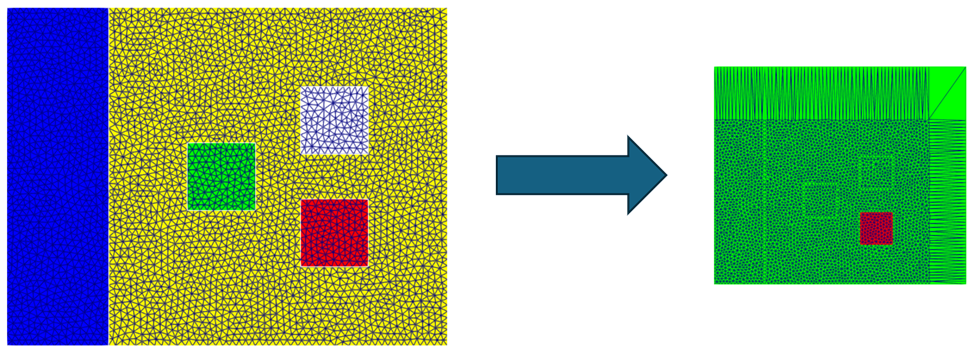
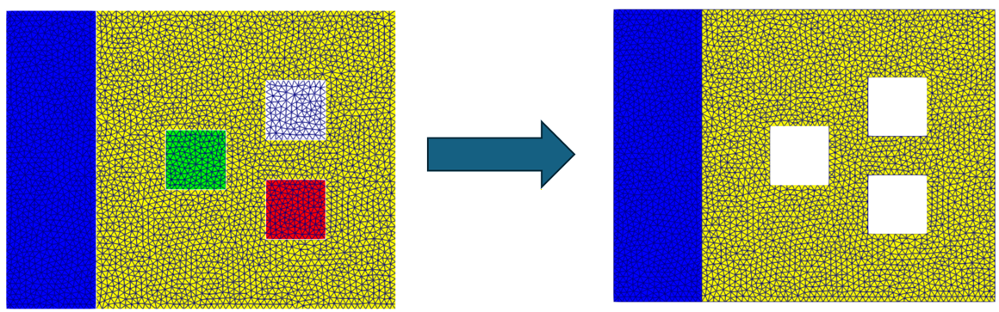
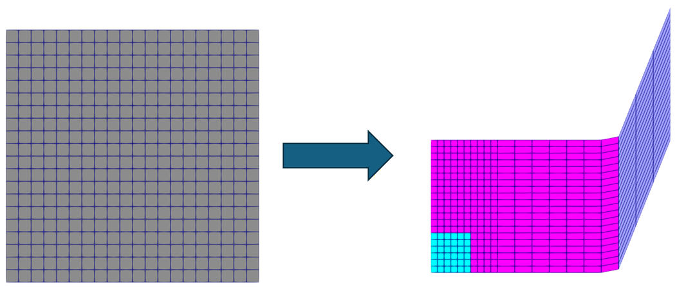
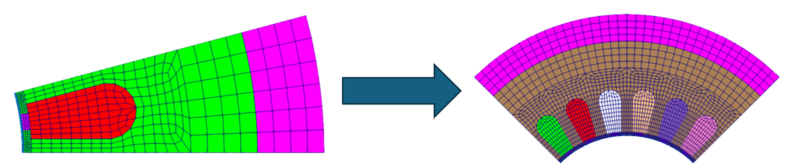
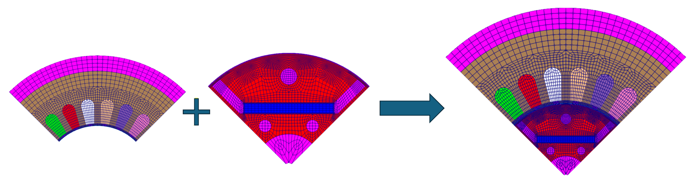
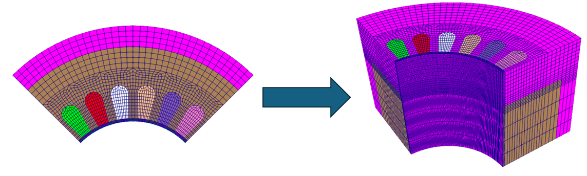
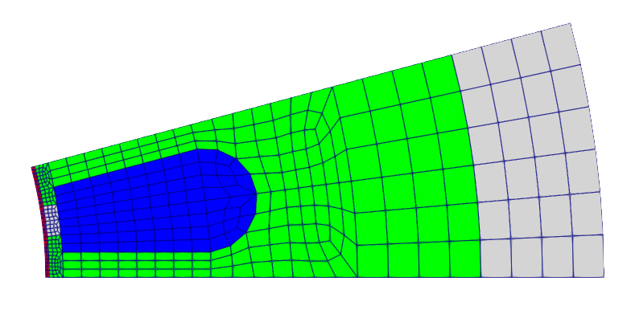
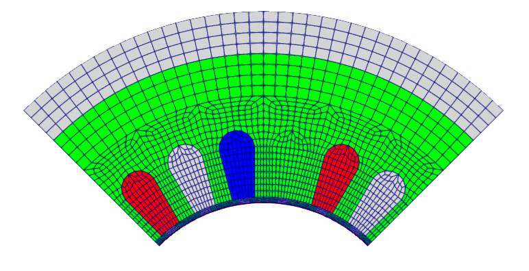
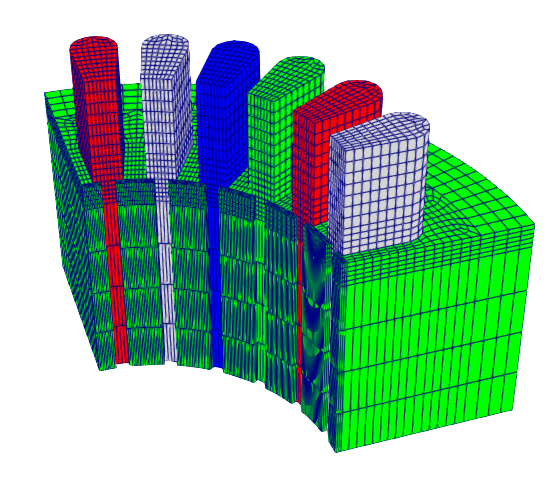

# Modification examples
&ensp;OSSのリポジトリexampleに、メッシュ操作の例をいくつか用意しています。利用の際の参考にしてください。

## Example 1 ~ 6
&ensp;基本的な変換例をそれぞれ記載しています。節点移動や材料IDの変更、回転コピーなどです。
それぞれのmeshmodi.jsonを参考にしてください。

・例１：節点移動と材料ID変更 
 

・例２：要素の削除 
 

・例３：節点の連続移動 
 

・例４：回転コピー 
 

・例５：メッシュ結合 
 

・例６：3次元モデルへの積み上げ 
 

## Example 7：pythonスクリプトを利用した一連の変換
&ensp;pythonを使って複数の変換コマンドを実行し、大幅なメッシュ操作を行う変換例です。
例として、磁石モータの対称部分モデルを読み込み、回転コピーなどを駆使して１極分モデルに拡張したうえで、積み上げを行い3Dモデルにします。

・元のモデル（固定子1スロットモデル）

・変換途中のモデル（固定子1極モデル）

・3D化したモデル

&ensp;この一連の操作をrun.pyを実行すればまとめて行ってくれます。上記はステータ部分の例ですが、サンプルでは同時にロータ側も行い、ステータとロータの1極分3Dモデルをまとめて作成します。
このサンプルを参考にして、自分で好きなjson変換コマンドを作れば、機能の許す範囲でメッシュを操作してくれます。

