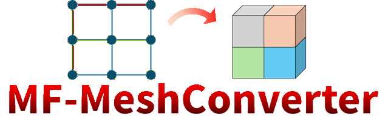

.. mf-meshconverter documentation master file, created by
   sphinx-quickstart on Tue Feb  3 13:14:27 2026.
   You can adapt this file completely to your liking, but it should at least
   contain the root `toctree` directive.

=====================================
MF-MeshConverter 
=====================================

   
| このページは、メッシュ修正操作機能を備える、メッシュコンバータOSSの解説ページです。 
| ソースコードは下記にアップされています。 
https://github.com/JP-MARs/SparseSolv

=====================================

ライブラリ内容
------------------

本OSSは、メッシュ修正操作機能を備える、メッシュコンバータです。
複数のメッシュフォーマットの読み書きと、読み込んだメッシュに対する操作機能を有しています。
既存のメッシャーソフトなどでは操作が難しい・面倒なメッシュ操作をコマンドで行うことができます。

メッシュ操作機能について
------------------
[注意] 
本OSSは作者が個人的に利用していたメッシュ操作機能をまとめ直したものです。
移植に際し、多数のメッシュ操作コマンドの全ての動作チェックはできていません（2026/7現在）。
メッシュ操作に不具合等がある場合はぜひご指摘ください。

OSSの構成
------------------
詳細なファイル構成・クラス構成などは、doxygenで自動生成したドキュメントがありますので、確認ください。
ただし、すべての関数・メソッドにコメントをつけきれておらず、代表的な部分のみコメントがついています。

ソースコードリファレンス
------------------
Doxygenによるソースコードのリファレンスはこちらです。
 `(Doxygenリファレンス) <./doxygen/index.html>`_

目次
------------------
.. toctree::
   :maxdepth: 2
   :caption: Contents:

   Introduction.md
   Format.md
   ModExample.md

